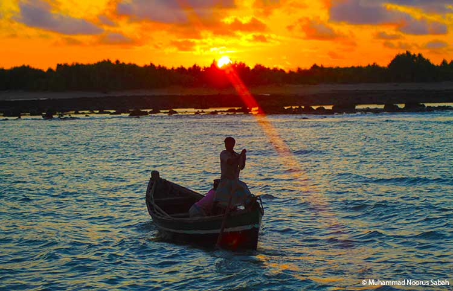
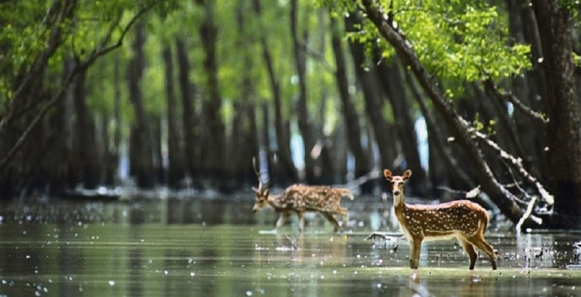
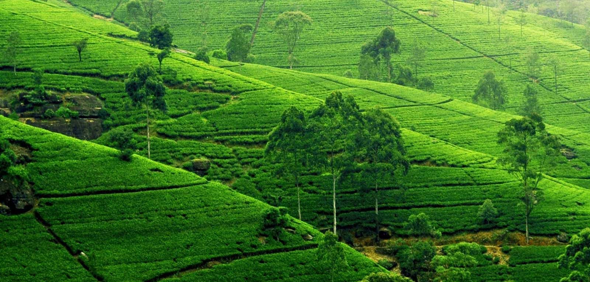

<!DOCTYPE html>
<head>
<title>Bangladesh </title>
<link rel="stylesheet" type="text/css" href="stylesheet.css"/> 
</head>
<body>
<header>
<h3>BEAUTIFUL BANGLADESH</h3>	
</header>

<ul>
	<li> <a href="">HOME</a></li>
	<li> <a href="">ABOUT</a></li>
	<li> <a href="">DIVISIONS</a></li>
	<li> <a href="river.html">RIVERS</a></li>
	<li> <a href="">TRADITIONS</a></li>
	<li> <a href="">CULTURES</a></li>
	<li> <a href="">PHOTO GALLARY</a></li>
</ul>

Bangladesh is the most beautiful country in the world.

</body>
</html>
